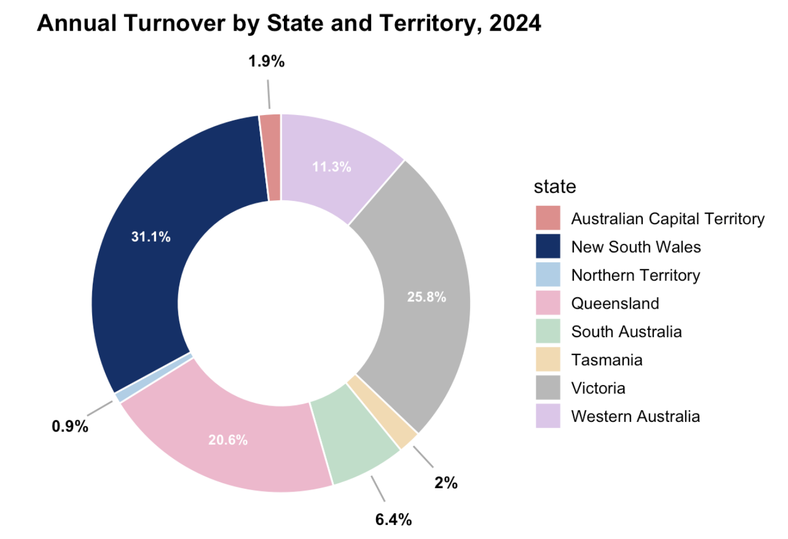
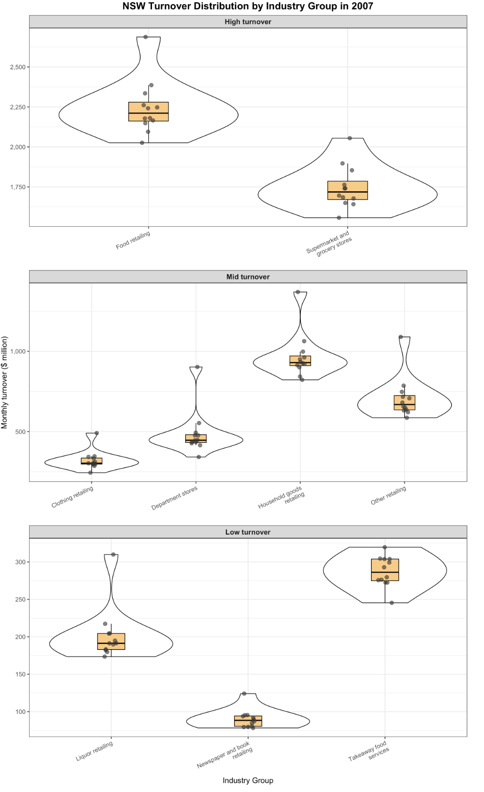
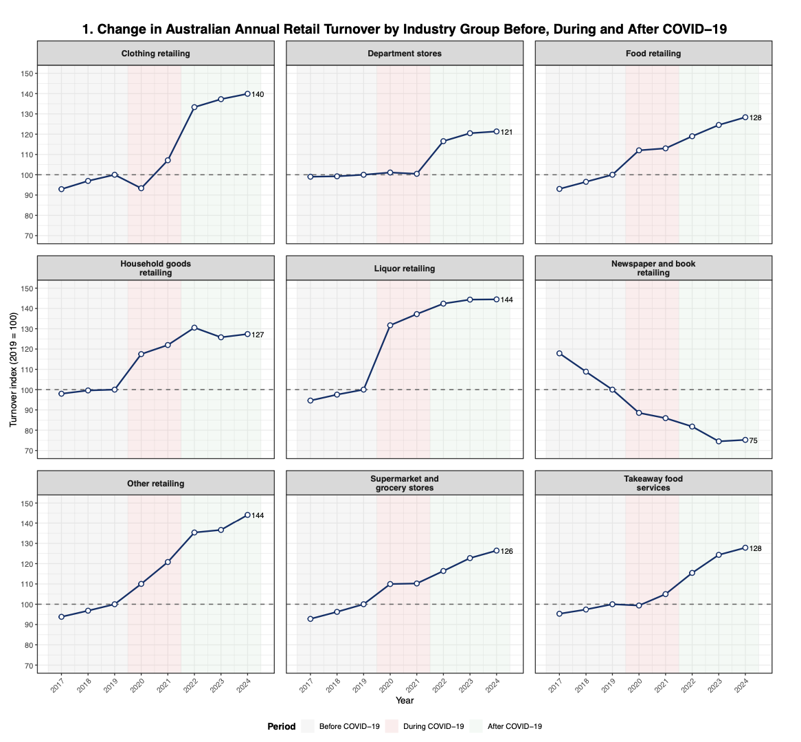
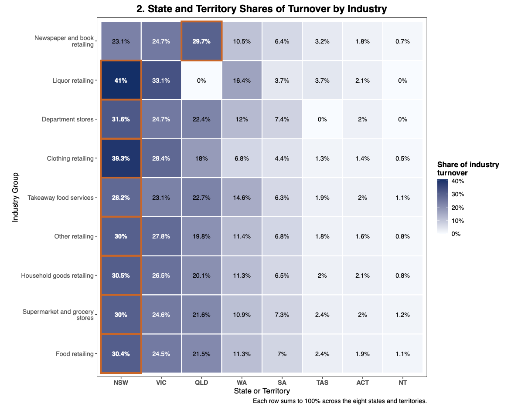
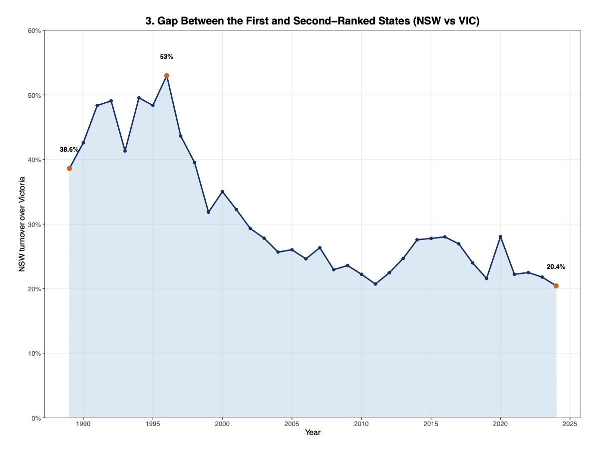
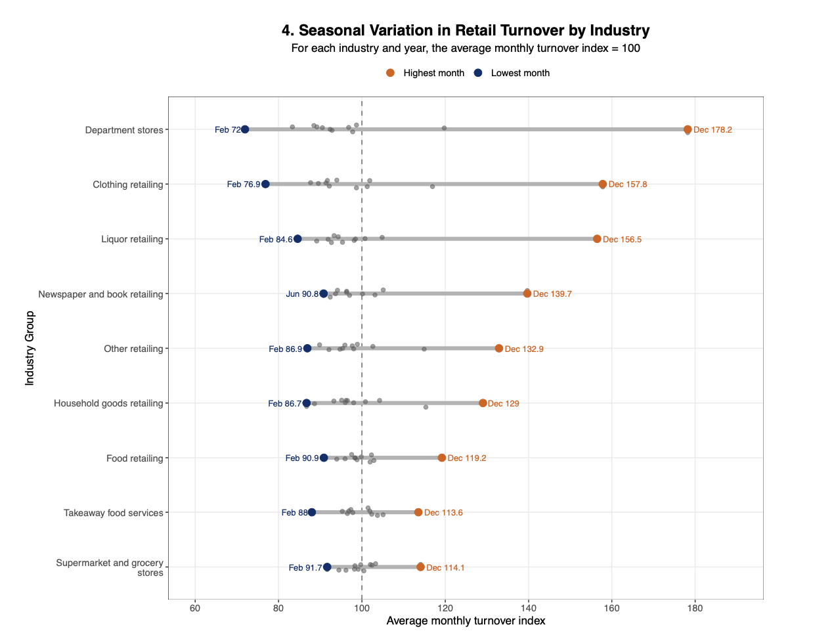

# Australian Retail Turnover Analysis

**R | tidyverse | dplyr | ggplot2 | Exploratory Data Analysis | Data Visualisation**

An exploratory analysis of Australian retail turnover examining how retail activity differs across **states, industries, time periods and seasonal cycles**.

The project moves beyond reporting total turnover to investigate the underlying structure of Australian retail activity, including the impact of COVID-19, geographic concentration, long-term competition between NSW and Victoria, and industry-specific seasonality.

---
## Project Overview

Australian retail turnover can appear straightforward when viewed only as a national total. However, aggregate figures can hide substantial differences between:

- states and territories,
- retail industries,
- periods of economic disruption,
- long-term geographic trends, and
- seasonal demand patterns.

This project uses Australian monthly retail turnover data from **1982 to 2025** to explore these differences and translate statistical graphics into meaningful business insights.

---
## Skills Demonstrated

**R | tidyverse | dplyr | ggplot2 | Data Visualisation | Exploratory Data Analysis**

This project demonstrates:

- Data cleaning and validation
- Missing-data assessment
- Exploratory data analysis
- Data aggregation
- Comparative analysis
- Time-series analysis
- Indexed data transformation
- Distribution analysis
- Ranking and contribution analysis
- Seasonal pattern identification
- Statistical visualisation
- Business-focused interpretation
- Communicating analytical findings through a structured visual story

---

### Key Analytical Questions

The analysis was structured around six questions:

1. How is Australian retail turnover distributed across states and territories?
2. How does monthly turnover differ between NSW retail industries?
3. How did industries change before, during and after COVID-19?
4. Does NSW's overall retail leadership extend to every industry?
5. Is Victoria closing the historical turnover gap with NSW?
6. Which industries experience the strongest seasonal variation?

---

# Dataset

The dataset contains monthly Australian retail turnover observations across states and industry groups.

| Dataset Feature | Description |
|---|---|
| Observations | **46,710** |
| Time period | **April 1982 – June 2025** |
| Monthly periods | **519** |
| Geographic coverage | **8 states and territories + Total State** |
| Industry coverage | **9 retail industries + Total Industry** |
| Turnover measure | **AUD millions** |
| Missing turnover values | **3,878** |

### Main Variables

- `date` - monthly observation date
- `value` — retail turnover in AUD millions
- `state` — Australian state or territory
- `industry_group` — retail industry
- `year` — calendar year
- `month` — calendar month

### Data Quality Considerations

- Missing turnover values were **retained rather than replaced or deleted**, avoiding unsupported assumptions in the dataset.
- The dataset begins in **April 1982**, meaning 1982 contains only nine months.
- The dataset ends in **June 2025**, meaning 2025 contains only six months.
- Annual comparisons involving these partial years therefore require careful interpretation.
- Missing-value availability also changes across parts of the historical series.

---

# Tools & Techniques

### R

Used as the primary analytical environment for data preparation, exploration and visualisation.

### tidyverse / dplyr

Used for:

- filtering,
- grouping,
- aggregation,
- ranking,
- feature creation,
- percentage calculations, and
- reshaping data for visual analysis.

### ggplot2

Used to develop professional statistical graphics including:

- donut charts,
- line charts,
- heatmaps,
- violin plots,
- indexed time-series charts,
- range plots, and
- comparative geographic visualisations.

### Analytical Techniques

- Exploratory Data Analysis
- Missing-data assessment
- Aggregation and ranking
- Distribution analysis
- Relative contribution analysis
- Indexed time-series analysis
- Relative gap analysis
- Seasonal indexing
- Comparative visualisation
- Business interpretation

---

# Analytical Workflow

```text
Raw Retail Turnover Data
          ↓
Data Structure & Quality Assessment
          ↓
Missing-Value and Coverage Analysis
          ↓
State & Industry Aggregation
          ↓
Distribution Analysis
          ↓
Time-Series Normalisation
          ↓
State / Industry Contribution Analysis
          ↓
Relative Gap Analysis
          ↓
Seasonality Analysis
          ↓
Business Interpretation
```

The analysis progresses from understanding the dataset to investigating increasingly specific business questions.

---
---

# Methodology

## 1. Data Quality Assessment

The dataset was examined for:

- data types,
- missing observations,
- date coverage,
- state coverage,
- industry coverage,
- incomplete years, and
- turnover distribution.

Missing turnover observations were retained rather than artificially replaced.

---

## 2. State Turnover

Annual turnover by state was calculated as:

```r
group_by(year, state) %>%
summarise(
  annual_turnover = sum(value, na.rm = TRUE)
)
```

---

## 3. Industry Distribution

Monthly observations were compared using:

- violin distributions,
- boxplots,
- individual monthly observations, and
- industry turnover tiers.

This allowed both typical turnover and within-year variability to be examined.

---

## 4. COVID-19 Industry Index

Each industry's annual turnover was normalised relative to 2019:

```text
Index = Annual Turnover / 2019 Turnover × 100
```

This controlled for differences in absolute industry size.

---

## 5. State Industry Share

Each state's contribution within an industry was calculated as:

```text
State Industry Share =
State Industry Turnover
÷ Total Industry Turnover
× 100
```

Each industry therefore sums to 100% across the eight states and territories.

---

## 6. NSW–Victoria Relative Gap

The difference between Australia's two largest retail markets was calculated as:

```text
NSW Relative Lead =
(NSW Turnover - Victoria Turnover)
÷ Victoria Turnover
× 100
```

---

## 7. Seasonal Index

Monthly turnover was standardised against each industry's average month within the same year:

```text
Monthly Index =
Monthly Turnover
÷ Industry-Year Monthly Average
× 100
```

Indices were then averaged across **2015–2024** to identify recurring seasonal patterns.

---

# Retail Landscape

## 1. Annual Turnover by State and Territory — 2024



**Where is Australian retail activity concentrated?**

### Key Findings

- **New South Wales** recorded the highest annual turnover in 2024 at approximately **$135.6 billion**.
- **Victoria** ranked second at approximately **$112.6 billion**.
- **Queensland** ranked third at approximately **$90.0 billion**.
- NSW, Victoria and Queensland together represented approximately **77.4% of turnover** across the eight states and territories.
- Western Australia contributed approximately **11.3%**, while South Australia represented approximately **6.4%**.
- Tasmania, ACT and Northern Territory collectively represented less than **5%**.

### Interpretation

The Australian retail market is geographically concentrated, particularly in the three largest eastern states.

However, total state turnover alone does not show **which industries create that leadership**.

This leads to a deeper question:

> Does NSW dominate because all of its industries are larger, or does its advantage depend on particular retail categories?

---

## 2. NSW Turnover Distribution by Industry — 2007



**How differently do NSW retail industries behave within the same state and year?**

Monthly turnover distributions were compared using violin plots, embedded boxplots and individual monthly observations.

Because industries operate at very different scales, they were separated into **high-, middle- and lower-turnover groups** to make their distributions easier to interpret.

### High-Turnover Industries

**Food retailing**

- Median monthly turnover was approximately **$2.2 billion**.
- Most months were concentrated around **$2.15–$2.30 billion**.
- A longer upper tail indicates several unusually strong months.

**Supermarket and grocery stores**

- Median monthly turnover was approximately **$1.7 billion**.
- Most months were concentrated around **$1.6–$1.8 billion**.
- Its typical turnover was clearly below food retailing.

### Middle-Turnover Industries

- **Household goods retailing:** median approximately **$900M**
- **Other retailing:** median approximately **$600M**
- **Department stores:** median approximately **$450M**
- **Clothing retailing:** median approximately **$300M**

Department stores showed substantial relative variation, with some months reaching approximately twice their typical turnover.

Clothing retailing had a comparatively narrow central distribution, suggesting more stable turnover during most months despite isolated higher observations.

### Lower-Turnover Industries

- **Takeaway food services:** median approximately **$280M**
- **Liquor retailing:** median approximately **$190M**
- **Newspaper and book retailing:** median approximately **$85M**

### Interpretation

The NSW market is not simply composed of large and small industries.

Industries also differ substantially in **variability**, suggesting that some categories may be much more sensitive to particular months or shopping periods.

This observation becomes important later when seasonality is analysed directly.

---

# Key Analytical Insights

# 3. COVID-19 Reshaped Industries Differently



**How did different industries change before, during and after COVID-19?**

Directly comparing turnover values would be misleading because industries differ substantially in size.

Each industry's annual turnover was therefore indexed against its own **2019 value**:

```text
Turnover Index =
Annual Turnover / 2019 Turnover × 100
```

An index of:

- `100` = equal to 2019
- `120` = 20% above 2019
- `80` = 20% below 2019

This makes relative industry movements directly comparable.

---

### Before COVID-19

Most industries were stable or gradually growing toward the 2019 baseline.

- Clothing increased from approximately **93 to 100** between 2017 and 2019.
- Food retailing increased from approximately **93 to 100**.
- Supermarket and grocery stores increased from approximately **93 to 100**.
- Department stores were almost unchanged around **99–100**.

One important exception was **newspaper and book retailing**.

- Its index declined from approximately **118 in 2017** to **100 in 2019**.
- The industry's decline therefore began **before COVID-19**.

### Insight

COVID-19 should not automatically be treated as the cause of every decline observed after 2019.

Some industries were already experiencing structural change.

---

### During COVID-19

Two very different industry responses emerged.

#### At-Home and Essential Spending Increased

**Liquor retailing**

- Increased to approximately **132 in 2020**.
- Reached approximately **137 in 2021**.
- Recorded one of the strongest immediate shifts.

**Household goods**

- Approximately **118 in 2020**
- Approximately **122 in 2021**

**Food retailing**

- Approximately **112 in 2020**
- Approximately **113 in 2021**

**Supermarket & grocery**

- Approximately **110 in 2020–2021**

**Other retailing**

- Reached approximately **121 in 2021**

These patterns are consistent with increased spending on products associated with home consumption during the pandemic period.

---

#### Other Industries Stagnated or Declined

**Clothing**

- Fell to approximately **93 in 2020**.
- Recovered to approximately **107 in 2021**.

**Takeaway food services**

- Stayed close to its 2019 baseline in 2020.
- Showed only moderate improvement in 2021.

**Department stores**

- Remained around its 2019 level.

**Newspaper and book retailing**

- Fell to approximately **89 in 2020**.
- Fell further to approximately **86 in 2021**.

### Insight

The pandemic did not produce a uniform retail shock.

Instead, it **redistributed spending between industries**.

---

### After COVID-19

The post-pandemic period produced another shift.

**Clothing**

- 2022: approximately **133**
- 2023: approximately **137**
- 2024: approximately **140**

This represents one of the strongest post-COVID recoveries.

**Other retailing**

- Reached approximately **144 by 2024**.

**Liquor retailing**

- Also reached approximately **144**, although growth slowed after its earlier pandemic surge.

**Food retailing**

- Reached approximately **128**.

**Takeaway food services**

- Reached approximately **128**.

**Supermarket and grocery stores**

- Reached approximately **126**.

---

### Two Important Exceptions

**Household goods**

- Peaked at approximately **131 in 2022**.
- Fell to approximately **126 in 2023**.
- Recovered slightly to approximately **127 in 2024**.

The pandemic-related increase therefore did not continue at the same pace.

**Newspaper and book retailing**

- Continued declining.
- Reached approximately **75 in 2024**.
- It was the only analysed industry finishing substantially **below its 2019 level**.

### Key Insight

> COVID-19 changed the composition of Australian retail spending rather than simply increasing or decreasing the entire retail market. Some industries benefited immediately, some recovered later, and newspaper and book retailing continued a structural decline already visible before the pandemic.

---

# 4. State Leadership Depends on the Industry



**Does NSW's overall retail leadership mean it leads every individual industry?**

Each state's 2024 turnover was calculated as a percentage of national turnover within each industry.

Each heatmap row therefore represents **100% of that industry's turnover across the eight states and territories**.

---

### NSW Leads Most Industries

NSW ranked first in **8 of the 9 industries analysed**.

Its strongest positions included:

| Industry | NSW Share |
|---|---:|
| Liquor retailing | **41.0%** |
| Clothing retailing | **39.3%** |
| Department stores | **31.6%** |
| Household goods | **30.5%** |
| Food retailing | **30.4%** |
| Other retailing | **30.0%** |
| Supermarket & grocery | **30.0%** |
| Takeaway food services | **28.2%** |

Victoria generally ranked second.

---

### One Industry Breaks the Pattern

**Newspaper and book retailing**

| State | Industry Share |
|---|---:|
| Queensland | **29.7%** |
| Victoria | **24.7%** |
| NSW | **23.1%** |

Queensland was the largest contributor in this category.

It was the **only industry in which NSW did not rank first**.

---

### NSW Dominance Also Varies in Strength

NSW's advantage was not equally strong across industries.

For example:

- NSW held **41%** of liquor turnover.
- NSW held **39.3%** of clothing turnover.
- But its share was only **28.2%** in takeaway food services.

This distinction is important because aggregate leadership can hide varying degrees of competitive strength.

---

### Smaller States

- Western Australia generally ranked fourth.
- South Australia contributed a smaller but consistent share.
- Tasmania, ACT and Northern Territory usually represented relatively small portions of individual industry turnover.

### Key Insight

> NSW clearly dominates Australian retail overall, but geographic leadership depends on the industry. Aggregate state rankings therefore provide only part of the market picture.

---

# 5. Victoria Is Closing the Historical Gap With NSW



### Analytical Question

**Is Victoria catching up with New South Wales in total retail turnover?**

NSW and Victoria have consistently been Australia's two largest retail markets.

Rather than comparing only their absolute dollar difference, the analysis calculates NSW's lead relative to Victoria:

```text
Percentage Gap =
(NSW Turnover - Victoria Turnover)
÷ Victoria Turnover × 100
```

This makes comparisons more meaningful across a market that has grown substantially over time.

---

### NSW Initially Extended Its Lead

In **1989**:

- NSW turnover exceeded Victoria by approximately **38.6%**.

The relative gap then expanded.

In **1996**:

- NSW's lead reached approximately **53%**.
- This was the **largest relative difference in the series**.

---

### The Trend Reversed After 1996

Following the peak:

- the gap fell sharply toward the end of the 1990s,
- reached just under **32% by 1999**, and
- then continued trending downward more gradually.

From the early 2000s onward, the gap generally moved between approximately **21% and 28%**.

There were temporary increases:

- around 2015–2016,
- and again around 2020.

However, neither changed the broader downward trajectory.

---

### 2024 Recorded the Narrowest Relative Gap

In 2024:

- NSW turnover ≈ **$135.6B**
- Victoria turnover ≈ **$112.6B**
- NSW lead ≈ **20.4%**

This was the **smallest relative gap observed across the 35-year comparison**.

### Key Insight

> Victoria has not overtaken NSW, but it has substantially reduced NSW's relative advantage. The gap peaked at 53% in 1996 and narrowed to only 20.4% by 2024, demonstrating long-term convergence between Australia's two largest retail markets.

---

# 6. Seasonal Variation Differs Substantially by Industry



**Which industries experience the strongest seasonal variation?**

Simply comparing raw monthly turnover would favour larger industries.

Monthly turnover was therefore normalised within each industry and year:

```text
Monthly Turnover Index =
Monthly Turnover
÷ Average Monthly Turnover for that Industry and Year
× 100
```

The analysis covers **2015–2024**.

An index of:

- `100` = average month
- `150` = 50% above an average month
- `80` = 20% below an average month

---

### December Is the Strongest Month Across Every Industry

All **nine industries** recorded their highest average turnover index in **December**.

This indicates a broad end-of-year retail pattern rather than a seasonal effect limited to one particular category.

---

### Department Stores Are the Most Seasonal

**Department stores**

- Lowest: February ≈ **72**
- Highest: December ≈ **178**

December turnover was therefore approximately **78% above an average month**, while February was approximately **28% below average**.

This represents the widest seasonal range among the industries analysed.

---

### Clothing and Liquor Also Show Strong Seasonality

**Clothing**

- February ≈ **77**
- December ≈ **158**

**Liquor**

- February ≈ **85**
- December ≈ **157**

These industries are therefore particularly dependent on high-turnover seasonal periods.

---

### Other Retail Categories

**Newspaper and book retailing**

- Lowest: June ≈ **91**
- Highest: December ≈ **140**

**Other retailing**

- February ≈ **87**
- December ≈ **133**

**Household goods**

- February ≈ **87**
- December ≈ **129**

---

### Essential and Food-Related Retail Is More Stable

**Food retailing**

- February ≈ **91**
- December ≈ **119**

**Takeaway food services**

- February ≈ **88**
- December ≈ **114**

**Supermarket and grocery stores**

- February ≈ **92**
- December ≈ **114**

Supermarket and grocery stores had one of the smallest ranges, suggesting comparatively stable year-round demand.

### Key Insight

> Seasonal exposure varies significantly by industry. Department stores, clothing and liquor depend heavily on the December peak, while food-related categories maintain much more consistent turnover throughout the year.

---

# Integrated Findings

The analysis reveals that Australian retail performance is shaped by several interacting dimensions.

### Geographic Concentration

- NSW remains Australia's largest retail market.
- Victoria and Queensland are also major contributors.
- The three largest states account for the majority of Australian retail turnover.

### Industry Structure

- NSW's aggregate leadership does not translate perfectly across every industry.
- Queensland leads newspaper and book retailing.
- NSW dominance is particularly strong in liquor and clothing.

### Long-Term State Competition

- NSW has consistently remained ahead of Victoria.
- However, its relative advantage peaked at **53% in 1996**.
- The gap fell to **20.4% in 2024**.
- Victoria has therefore progressively converged toward NSW's turnover level.

### COVID-19

- Spending shifted toward food, supermarkets, household goods and liquor.
- Clothing initially declined but later recovered strongly.
- Post-COVID growth differed substantially between industries.
- Newspaper and book retailing's decline began before COVID-19 and continued afterward.

### Seasonality

- December is the strongest month across all nine industries.
- Department stores show the greatest seasonal exposure.
- Clothing and liquor also experience substantial seasonal swings.
- Food and grocery-related industries are considerably more stable.

---

# Analytical Story

The six visualisations build on one another:

```text
Where is retail activity concentrated?
        ↓
NSW is the largest state
        ↓
But what does its industry structure look like?
        ↓
Industries differ greatly in size and variability
        ↓
How did a major disruption affect those industries?
        ↓
COVID produced very different industry responses
        ↓
Does NSW dominate all of those industries?
        ↓
No — geographic leadership varies by category
        ↓
Is NSW's overall leadership strengthening?
        ↓
No — Victoria has progressively narrowed the gap
        ↓
What other recurring pattern affects industry turnover?
        ↓
Seasonality varies substantially, with December the dominant peak
```

---

# Business Implications

Although this project is exploratory rather than prescriptive, the findings demonstrate several practical implications.

### Retail Planning

- National turnover should not be treated as a single homogeneous market.
- State-level and industry-level analysis can reveal patterns hidden by aggregate figures.

### Geographic Strategy

- NSW and Victoria remain particularly important retail markets.
- However, category-specific strategies may be required because geographic leadership differs between industries.

### Seasonal Planning

Industries with strong December peaks may require:

- earlier inventory preparation,
- temporary staffing adjustments,
- seasonal campaign planning, and
- stronger cash-flow preparation.

More stable categories may require less dramatic seasonal adjustment.

### Structural Trend Monitoring

Long-term decline should be separated from temporary economic disruption.

Newspaper and book retailing provides an important example: its downward trend existed before COVID-19 and continued afterward.

### Benchmarking

Indexed measures allow businesses to compare categories of very different scales without allowing the largest industries to dominate the analysis.


# Conclusion

Australian retail turnover is not defined by one uniform trend.

The analysis shows that:

- **geographic concentration** determines where much of Australian retail activity occurs,
- **industry structure** determines how that activity is distributed,
- **COVID-19** affected different retail categories in fundamentally different ways,
- **Victoria has progressively narrowed NSW's historical lead**, and
- **seasonality affects industries to very different degrees**.

The strongest insight from the project is therefore not simply which state or industry records the highest turnover.

It is that **retail performance should be analysed simultaneously across geography, industry, time and seasonality to understand what is actually driving the market.**

